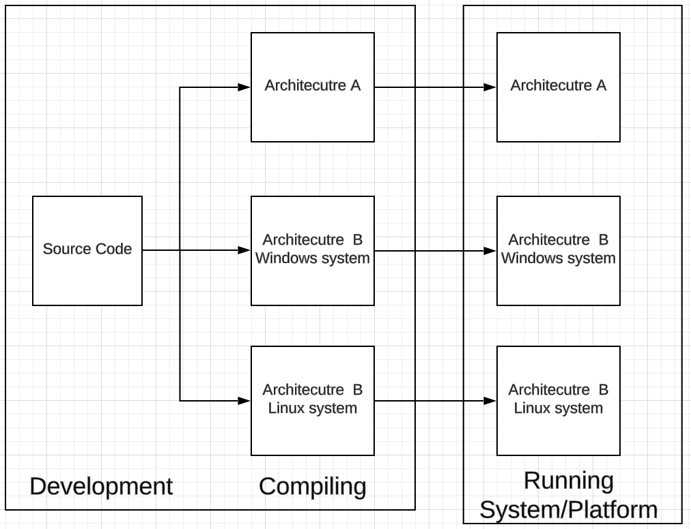
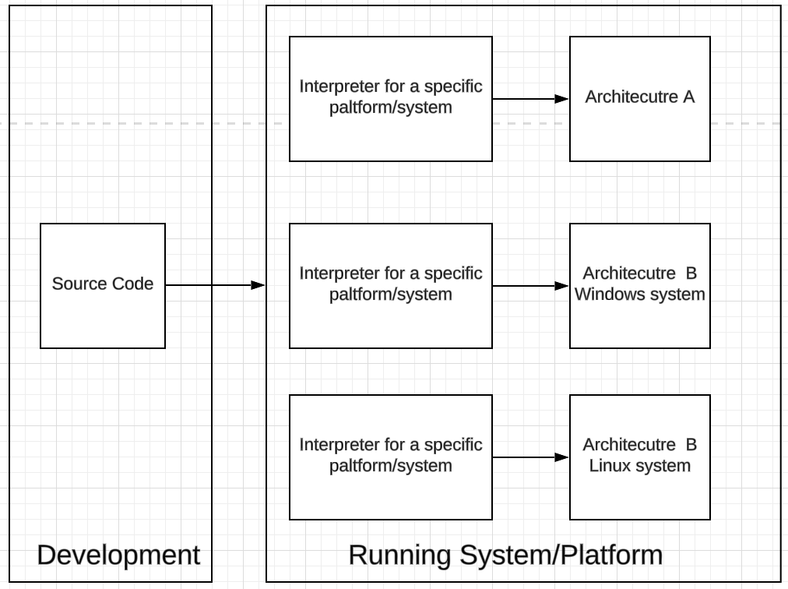
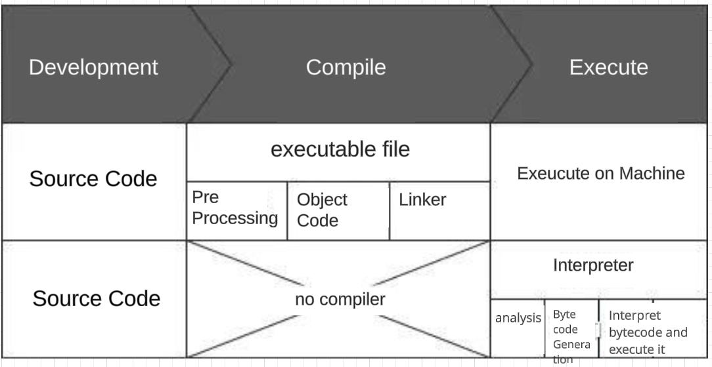

## Motivation

Python is an interpreted language, it means that the source code needs to be executed through an interpreter.  As a Python Programmer, understanding the  differences between compilers and interpreters is for a better grasp of the underlying techniques of Python and the whole software engineering world.

First, let's talk about Python.
It has the following characteristics:
- **Object-oriented**: it refers to the ability to use encapsulation, inheritance, and polymorphism in program design.
- **Dynamic language**: It's a language that can change its structure at runtime; for example, adding attributes to an object of a class that did not exist during program execution.
- **Dynamic typing**: Variables do not need to specify a type, but the interpreter needs to identify the data type when executing the code; this feature makes programming simpler, but reduces the efficiency of code execution.
- **High-level language**: it refers to programming languages that are highly encapsulated, compared to machine language, they are more suitable for humans to write and read.
- **Interpreted language**: it refers to a language that does not need to be **compiled** and can directly interpret the source code into machine language for execution.

## compiled languages and interpreted languages

Programming languages are divided into compiled languages and interpreted languages. It's essential to understand their differences to better grasp the distinctions between compilers and interpreters.

### Compiler

As you know, C and C++ are both compiled languages. The characteristic of compiled languages is their **fast execution speed**. What about the disadvantages, though?

Compiled languages require a compiler to process them, with the main workflow as follows: 

```txt
Source Code → Preprocessor → Compiler → Object Code(Binary Machine Code) → Linker → Executables
```

In this workflow, the compiler invokes the preprocessor for 

- **Preprocessor**: processing, optimizing and transforming the source code, e.g., removing comments, macro definitions, including files, and conditional compilation. 
- **Compiler**: compiling the preprocessed source code into **Object Code** (binary machine language), 
- **Linker**: providing linking with library files, e.g., operating system's API, 

Finally, it forms an executable program that the machine can execute.

In this workflow, the object code must match the machine's CPU architecture, and the library files must match the operating system. If you want to run C language source code on machines with different CPUs or systems, it needs to be compiled for the different CPU architectures and operating systems to run on the machine. 

Thus, we see the downside of compiled languages: they are not suitable for cross-platform use. Moreover, that's why an exe program can run on Windows but not on Mac, even if the CPU is the same.

If the above feels a bit complex, let me give you an example from everyday life: Imagine a Chinese teacher who teaches many foreign students from the UK, the USA, France, Germany, and South Korea. When this teacher distributes learning materials, they need to first translate the Chinese materials into English, German, French, and Korean electronic documents, then distribute them to students from each country for study. This translation work is very tedious. Not only does it require translation into each country's language, but it also needs to account for the differences between British and American English, creating different versions accordingly. Furthermore, each time the materials are updated, they have to be translated all over again.

<details>
  <summary> Chinese Teacher Metaphor for understanding Compiler </summary>
 Imagine a Chinese teacher who teaches many foreign students from the UK, the USA, France, Germany. When this teacher distributes learning materials, She needs to first translate the Chinese materials into English, German, and French documents, then distribute them to students from each country for study. This translation work is very tedious. Not only does it require translation into each country's language, but it also needs to account for the differences between British and American English, creating different versions accordingly. Furthermore, each time the materials are updated, they have to be translated all over again.
In this example, the Chinese teacher is like the developer of a compiled language, the Chinese materials are like the source code of the compiled language, the translated materials are like the machine language for different CPU architectures, and the students speaking different languages are like machines with different CPU architectures. The American and British students are like machines with the same CPU architecture but different operating systems.
</details>


### Interpreter

<details>
  <summary> Metaphor Continued</summary>
  the exhausted Chinese teacher starts to look for a solution. She thinks, why should I do the translating myself instead of giving each student an automatic translation software? So, the teacher provides each student with a custom automatic translation software, which can translate the original Chinese materials page by page into different languages for the students to read. Now, the situation is much easier for the teacher. She doesn't need to consider making materials in various languages anymore and can just focus on creating the Chinese materials.
</details>

The vanilla/early version of compiler is as

``` Source code → interpreter ```



The source code does not need to be compiled into an executable program. 

During program execution, the interpreter 

- **Lexical analysis:** Breaks down the source code into individual tokens and identifies their categories.

- **Syntax analysis:** Checks whether the code structure is correct according to the grammar rules and generates a syntax tree.

- **Semantic analysis:** Checks whether the code semantics are correct and performs type checking and other operations.

- **Bytecode generation:** Generates bytecode from the syntax tree. Bytecode is an intermediate code that the interpreter can understand and execute.

- **Interpretation execution:** 
  - **Syntax analysis:** The interpreter checks whether the syntax of the bytecode is correct.
  - **Semantic analysis:** The interpreter checks whether the semantics of the bytecode are correct.
  - **Bytecode interpretation:** The interpreter translates the bytecode into machine instructions.
  - **Instruction execution:** The CPU executes the translated machine instructions.



Interpreted languages have different interpreters on different platforms, so the goal of cross-platform source code is achieved. Developers do not need to consider how to compile on each platform, they only need to focus on writing code, and the written code can be executed correctly on any platform without modification (or minimal modification, e.g., the fork() function is supported in Linux, while in a Windows system, this function is not supported.)

When Python programs run, as in the example above, the source code is first completely transformed and compiled into more efficient bytecode, saved as a “.pyc” bytecode file. Then, the translator executes it line by line translating it into machine language.

Note: When executing source code in a Shell, no intermediate file is generated; the source code is read, transformed into bytecode, and then interpreted directly.
