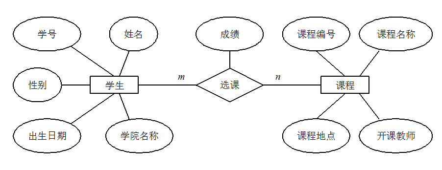

数据库知识基础，这部分内容一定要理解记忆。虽然这部分内容只是理论知识，但是非常重要，这是后面学习 MySQL 数据库的基础。PS: 这部分内容由于涉及太多概念性内容，所以参考了维基百科和百度百科相应的介绍。

Database fundamental knowledge must be understood and memorized. Although this part is just theoretical knowledge, it is very important as it lays the foundation for later learning MySQL databases. PS: This part involves many conceptual contents, so it refers to Wikipedia and Baidu Baike for the introductions.

## Databse, Database Management System, Database System, Database Administrator

- **Database**: A database (abbreviated as DB) is a collection of information, or more precisely, a collection of data managed by a database management system.
- **Database Management System**: A Database Management System (abbreviated as DBMS) is a large software used to manipulate and manage databases, typically used to establish, use, and maintain databases.
 
- **Database System**: A Database System (abbreviated as DBS) generally consists of software, the database, and a database administrator (DBA).
  
- **Database Administrator**: A Database Administrator (abbreviated as DBA) is responsible for the comprehensive management and control of the database system.

## Tuple, Key, Candidate Key, Primary Key, Prime Attribute, Non-prime Attribute
- **Tuple**: A tuple in a relational database refers to a row in a table, which represents a record in the database. Each column in the table is considered an attribute. In the context of a two-dimensional table, a tuple is also referred to as a row.
- **Key**: A key is an attribute or a set of attributes that uniquely identifies an entity in a table.
- **Candidate Key**: A candidate key is an attribute or a set of attributes that uniquely identifies a tuple in a relation, and no subset of these attributes can uniquely identify a tuple. For example, in a student entity, "student ID" can uniquely identify a student, and it's assumed that a combination of "name" and "class" can also uniquely distinguish students, thus both {student ID} and {name, class} are candidate keys.
- **Primary Key**: A primary key, also known as a primary code, is selected from among the candidate keys. There can only be one primary key in an entity set, although there may be multiple candidate keys.
Foreign Key: A foreign key, also known as an external key, is an attribute in one relation that is a primary key in another relation.
- **Prime Attribute**: Attributes that appear in any candidate key are known as prime attributes. For example, in the relation Worker (worker ID, ID number, name, gender, department), both worker ID and ID number can uniquely identify the relation, hence they are prime attributes. If the primary key is a set of attributes, then all attributes in that set are prime attributes.
- **Non-prime Attribute**: Attributes that are not included in any candidate key are called non-prime attributes. For example, in the relation Student (student ID, name, age, gender, class), where "student ID" is the primary key, the attributes "name", "age", "gender", and "class" are non-prime attributes.

## ER Diagram

When working on a project, it is essential to try drawing an ER diagram to clarify the database design. This is also a common topic interviewers might ask. An ER diagram, short for Entity Relationship Diagram, provides a method to represent entity types, attributes, and relationships. An ER diagram consists of the following three elements:

Entity: Typically a real-world business object, though logical objects are also permissible. For example, in a campus management system, entities would include students, teachers, courses, classes, etc. In an ER diagram, entities are represented by rectangular boxes.
Attribute: Attributes are properties owned by an entity, used to describe the elements that make up the entity. In product design, this could be understood as fields. In an ER diagram, attributes are represented by ovals.
Relationship: This represents the relationships between entities. In ER diagrams, relationships are depicted using diamonds. These relationships not only have business associations but can also be quantitatively described in terms of the number of entities involved. For example, the relationship where a class has multiple students is represented as a kind of entity relationship. The diagram below is an ER diagram of students selecting courses, where each student can choose several courses, and each course can also be selected by several students, indicating a many-to-many (M:N) relationship. Other types of entity relationships include one-to-one (1:1) and one-to-many (1:N).

In database design, ensuring that data tables conform to certain normal forms (Normalization) is crucial to avoid data redundancy and maintain data integrity. 

- **1NF (First Normal Form)**: The First Normal Form (1NF) requires that each field in a table must contain only atomic (indivisible) values, meaning no field can contain multiple values or repeated combinations. This ensures that each field maintains consistency and independence. First Normal Form is a basic requirement for relational databases to ensure the consistency of each field.

- **2NF (Second Normal Form)**: 2NF, based on 1NF, eliminates partial functional dependencies of non-prime attributes on the key. As shown in the diagram below, it demonstrates the transition from the First Normal Form to the Second Normal Form. The Second Normal Form adds a column based on the First Normal Form, which is called the primary key, and all non-prime attributes depend on this primary key.
  
    | StudentID | StudentName | Course |
    |-----------|-------------|--------|
    | 1         | Xiao Ming   | Math   |
    | 1         | Xiao Ming   | Physics|
    | 2         | Xiao Hong   | Chemistry|
    | 3         | Xiao Gang   | Biology|
    | 3         | Xiao Gang   | Chemistry|
    | 3         | Xiao Gang   | Physics|
    (Conforming to 1NF)

    | StudentID | StudentName | Courses       |
    |-----------|-------------|---------------|
    | 1         | Xiao Ming   | Math, Physics |
    | 2         | Xiao Hong   | Chemistry     |
    | 3         | Xiao Gang   | Biology, Chemistry, Physics |
    (Not Conforming to 1NF)
    
    | StudentID | StudentName | Major       |
    |-----------|-------------|-------------|
    | 1         | Xiao Ming   | Computer Science |
    | 2         | Xiao Hong   | Chemistry   |

    | StudentID | Course   | Grade |
    |-----------|----------|-------|
    | 1         | Math     | 90    |
    | 1         | Physics  | 85    |
    | 2         | Chemistry| 88    |
    Conforming to 2NF

    | StudentID | StudentName | Course   | Grade | Major         |
    |-----------|-------------|----------|-------|---------------|
    | 1         | Xiao Ming   | Math     | 90    | Computer Science |
    | 1         | Xiao Ming   | Physics  | 85    | Computer Science |
    | 2         | Xiao Hong   | Chemistry| 88    | Chemistry       |
    Not Conforming to 2NF

- **3NF (Thrid Normal Form)**: 3NF builds on 2NF by eliminating transitive functional dependencies of non-prime attributes on the key. A database design that conforms to 3NF typically resolves issues of excessive data redundancy and anomalies related to insertion, modification, and deletion. For example, in the relation R(StudentID, Name, DepartmentName, DepartmentHead), where StudentID → DepartmentName and DepartmentName → DepartmentHead, there exists a transitive functional dependency of the non-prime attribute DepartmentHead on StudentID. Therefore, the design of this table does not meet the requirements of 3NF

### Important Concepts:
- Functional Dependency: If attribute set X uniquely determines attribute set Y, then Y is functionally dependent on X, and this relationship is denoted as X → Y.
- Partial Functional Dependency: If attribute set X → Y, and there exists a subset X0 of X, where X0 → Y and no proper subset of X0 can functionally determine Y, then Y has a partial functional dependency on X0. This type of dependency occurs commonly within composite keys where only part of the key determines another attribute.
- Full Functional Dependency: If every element of X is required to uniquely determine Y (i.e., no subset of X can determine Y), then Y has a full functional dependency on X. This type of dependency means Y is fully functionally dependent on X without involving any subsets of X.
- Transitive Functional Dependency: In a relation R(U), where X, Y, Z are subsets of U and X determines Y, Y determines Z, but not necessarily X determines Z, there exists a transitive functional dependency (XUY) → X. Transitive functional dependency involves a situation where one attribute indirectly determines another through a third attribute.

## Difference between Primary Key and Foreign Key
Primary Key (PK): The primary key is used to uniquely identify a tuple in a table, cannot be duplicated, and must not be null. A table can only have one primary key.

Foreign Key (FK): The foreign key is used to establish a relationship with another table. A foreign key is to link to the primary key of another table, can be duplicated, and can be null. A table can have multiple foreign keys.

## 为什么不推荐使用外键与级联？

对于外键和级联，阿里巴巴开发手册这样说到：

> 【强制】不得使用外键与级联，一切外键概念必须在应用层解决。
>
> 说明: 以学生和成绩的关系为例，学生表中的 student_id 是主键，那么成绩表中的 student_id 则为外键。如果更新学生表中的 student_id，同时触发成绩表中的 student_id 更新，即为级联更新。外键与级联更新适用于单机低并发，不适合分布式、高并发集群；级联更新是强阻塞，存在数据库更新风暴的风险；外键影响数据库的插入速度

为什么不要用外键呢？大部分人可能会这样回答：

1. **增加了复杂性：** a. 每次做 DELETE 或者 UPDATE 都必须考虑外键约束，会导致开发的时候很痛苦, 测试数据极为不方便; b. 外键的主从关系是定的，假如那天需求有变化，数据库中的这个字段根本不需要和其他表有关联的话就会增加很多麻烦。
2. **增加了额外工作**：数据库需要增加维护外键的工作，比如当我们做一些涉及外键字段的增，删，更新操作之后，需要触发相关操作去检查，保证数据的的一致性和正确性，这样会不得不消耗资源；（个人觉得这个不是不用外键的原因，因为即使你不使用外键，你在应用层面也还是要保证的。所以，我觉得这个影响可以忽略不计。）
3. **对分库分表不友好**：因为分库分表下外键是无法生效的。
4. ……

我个人觉得上面这种回答不是特别的全面，只是说了外键存在的一个常见的问题。实际上，我们知道外键也是有很多好处的，比如：

1. 保证了数据库数据的一致性和完整性；
2. 级联操作方便，减轻了程序代码量；
3. ……

所以说，不要一股脑的就抛弃了外键这个概念，既然它存在就有它存在的道理，如果系统不涉及分库分表，并发量不是很高的情况还是可以考虑使用外键的。
